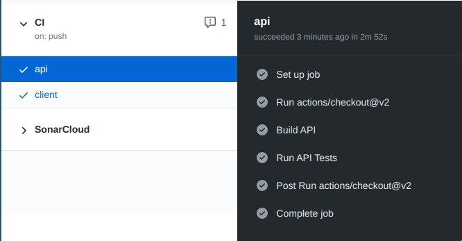
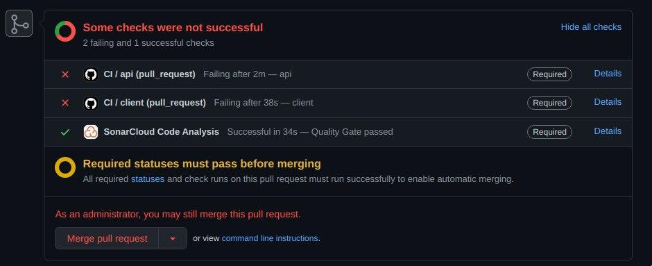
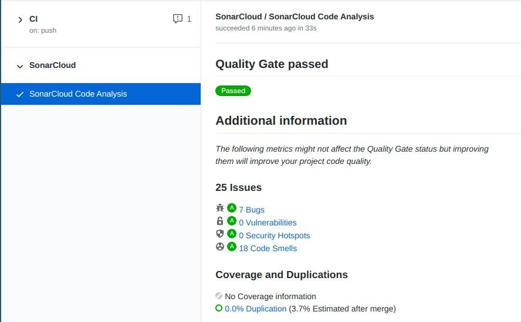

[](https://sonarcloud.io/dashboard?id=silvasara_Trabalho-Individual-2020-1)
[](https://sonarcloud.io/dashboard?id=silvasara_Trabalho-Individual-2020-1)

# Solução do trabalho
## Conteinerização e Orquestração
A aplicação foi divida em 3 containers [Docker](https://docs.docker.com/): `api, client e database`.

O arquivo da imagem da api está em `./api/Dockerfile`, e da imagem do client está em `./client/Dockerfile`. Já para o database foi usada a imagem pública `postgres`.

Para gerenciar a comunicação entre os containers foi utilizado o [Docker Compose](https://docs.docker.com/compose/). Os serviços estão definidos no arquivo `./docker-compose.yml`.

### Pré-requisitos
* docker:19.03.0+
* docker-compose:1.26.0+

### Como rodar
Para utilizar a aplicação execute os seguintes comandos:
* Para construir os containers:
```
$ docker-compose build
```

* Para subir os containers:
```
$ docker-compose up
```

A aplicação poderá ser usada acessando `http://localhost:8080/`.

### Execução dos testes
Com os containers up, utilize os seguintes comandos para executar os testes:

```bash
# backend
$ docker exec api rake test

# frontend
$ docker-compose run client yarn run test:unit
```

## Integração Contínua
A pipeline de Integração Contínua foi feita com [Github Actions](https://github.com/features/actions). Há um *job* para a api e outro para o client e em cada *job* tem a etapa de build e a etapa de testes. As etapas podem ser vistas no arquivo `.github/workflows/ci.yml`.



A branch `master` foi protegida para bloquear pull requests com alguma falha na execução da pipeline ou na análise estática do código. Nesse caso, apenas administradores do repositório podem fazer o merge do pull request:



### Coleta de métricas
Para fazer a análise estática do código e obter as métricas foi utilizado o [SonarCloud](https://sonarcloud.io/documentation/). A cada commit na branch master é feita a análise estática.


